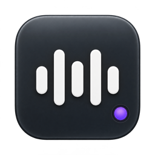

<p align="center">
  
</p>

# MenuTune

Ein privater YouTube-Mini-Player für die macOS-Menüleiste. Öffne den Player per Klick, starte deine Musik und klappe das Menü wieder zu. Dieselbe WebView bleibt dabei bestehen.

## Starten

Voraussetzungen: macOS 14 oder neuer und eine installierte Swift-6-Toolchain (Xcode). Keine zusätzlichen Pakete, kein API-Schlüssel und kein eigener Server.

```sh
bash scripts/build-app.sh
open build/MenuTune.app
```

MenuTune erscheint dauerhaft als Wellenform in der Menüleiste. Ein kleiner Punkt unten rechts zeigt den Status: grün beim Abspielen, gelb bei Pause, kein Punkt bei inaktiver Wiedergabe. Die App hat keinen Dock-Eintrag. Über Rechtsklick erreichst du Play/Pause, den nächsten Titel und Beenden.

## Bedienung

- **⌘⇧Y** öffnet und schließt den Player global, auch während du in einer anderen App arbeitest. Beim Schließen per Hotkey geht der Fokus zurück zur vorherigen App. Die Wiedergabe läuft dabei weiter.
- Der Größenumschalter unten wechselt zwischen **Standard** (448 × 252 Punkte Video), **Mittel** (320 × 180) und **Mini** (192 × 108). Mini zeigt nur das Video und die untere Leiste. Die Wiedergabe läuft beim Größenwechsel weiter; die gewählte Größe wird lokal gespeichert und gilt auch für das Pop-out-Fenster.
- Über das Pop-out-Symbol unten links lässt sich das Video in ein randloses Fenster im Vordergrund auskoppeln. Es weicht der Maus zwischen **unten rechts → mittig rechts → oben rechts → mittig rechts → unten rechts** aus und überspringt belegte Zielpositionen. Dock und Menüleiste werden berücksichtigt; Mausklicks gehen durch das Fenster an die Arbeits-App darunter.
- Zum Bedienen oder Zurückholen das Menüleisten-Icon bzw. **⌘⇧Y** verwenden. Dort lässt sich auch die Größe des ausgekoppelten Videos ändern. Play/Pause und der nächste Titel bleiben über das Rechtsklick-Menü erreichbar. Nach einem App-Neustart ist der Pop-out-Modus zunächst aus.
- YouTube-Link einfügen und mit **+** zur Warteschlange hinzufügen. Enter fügt den Titel hinzu und startet ihn direkt.
- Jedes Video steht höchstens einmal in der Warteschlange. Ein bereits vorhandener Link legt keinen zweiten Eintrag an; die Statuszeile weist darauf hin, und mit Enter startet der vorhandene Eintrag. Ältere Listen mit Doppelungen werden beim Laden einmalig zusammengeführt, wobei der erste Eintrag samt Titel und Position bestehen bleibt.
- Beim Öffnen wird die Zwischenablage einmalig auf einen YouTube-Link geprüft. Das Häkchen übernimmt ihn in die Warteschlange, das X verwirft den Vorschlag bis zum nächsten Kopieren. Ohne Bestätigung wird nichts hinzugefügt oder gestartet. Es gibt keine Hintergrundüberwachung der Zwischenablage.
- Die üblichen Mac-Tastenkürzel wie `⌘V`, `⌘C`, `⌘X`, `⌘A` und `⌘Z` funktionieren im Linkfeld.
- Links von `youtube.com`, `youtu.be`, YouTube Music, Shorts, Live und Embed werden unterstützt; beim direkten Start wird ein Zeitparameter wie `t=3s` berücksichtigt.
- Auf einen Titel klicken, um ihn abzuspielen. Über sein Aktionsmenü kannst du ihn verschieben oder entfernen.
- Play/Pause, Lautstärke und Position werden direkt im YouTube-Player bedient. Es gibt keine doppelte Steuerungsleiste. Der Statuspunkt folgt auch diesen Player-Aktionen.
- Über das Menü neben **Warteschlange** lässt sich ein Titel oder die ganze Liste wiederholen. Nächster Titel und Play/Pause sind zusätzlich über Rechtsklick auf das Menüleisten-Symbol erreichbar.
- Ein Klick auf **Warteschlange** klappt die Liste auf und zu. Der Player bleibt dadurch kompakt; der Zustand wird lokal gespeichert und gilt beim nächsten Start weiter.
- Ein Klick außerhalb oder auf den Pfeil oben schließt das Menü. Bei Titelwechseln öffnet es sich nicht automatisch.
- Fehler erscheinen innerhalb des Players. Sie öffnen kein zusätzliches Fenster.
- Sperrt YouTube ein Video für eingebettete Player, überspringt MenuTune es während der laufenden Wiedergabe und zeigt den Grund in der Statuszeile. Sind alle Titel gesperrt, bleibt die Wiedergabe mit einer Meldung stehen.
- Startest du im Video eine YouTube-Empfehlung, folgt die Statusanzeige ihr. Play/Pause wirken dann auf dieses Video; der Warteschlangen-Titel läuft erst wieder nach einem Klick auf seine Zeile.
- Warteschlange, Lautstärke, Playergröße und der auf-/zugeklappte Zustand der Liste werden lokal gespeichert. Beim nächsten App-Start beginnt keine automatische Wiedergabe.

Die lokale Datei liegt unter `~/Library/Application Support/MenuTune/library.json`. Ist sie beschädigt, bleibt sie unverändert; eine Meldung weist darauf hin, dass Änderungen vorerst nicht gespeichert werden. Nach Sicherung bzw. Wiederherstellung der Datei die App neu starten.

## Aktueller Umfang

Version 0.1 ist ein Machbarkeitsprototyp mit einer gespeicherten Warteschlange. Mehrere benannte Playlists, automatische Empfehlungen, Hover-Vorschau, Google-Anmeldung, Medientasten und Autostart sind noch nicht enthalten. Nicht jedes YouTube-Video erlaubt die Wiedergabe in eingebetteten Playern. Solche Titel werden übersprungen; öffnen lassen sie sich über den Link, den der eingebettete Player selbst anzeigt.

Die Wiedergabe nutzt den normalen YouTube-IFrame-Player in einer persistenten `WKWebView`. Es werden keine Videos heruntergeladen, Tonspuren extrahiert oder Werbeblocker eingebaut. Metadaten werden über YouTubes oEmbed-Endpunkt geladen. YouTube erhält beim Laden/Abspielen die üblichen Web-Anfragen und kann Cookies in der eigenen WebView speichern; die App importiert keine Browser-Cookies.

YouTubes Entwicklerbedingungen untersagen Hintergrundplayer. Private Nutzung stellt keine zugesicherte Ausnahme dar. Das Ein-/Ausblenden ist hier ausdrücklich ein persönlicher technischer Prototyp; dauerhaftes Funktionieren bei zukünftigen Änderungen durch YouTube oder WebKit wird nicht vorausgesetzt.

## Entwicklung und Tests

```sh
swift test
bash scripts/build-app.sh
```

Ein optionaler Test am echten Player protokolliert die Wiedergabe bei sichtbarem/geschlossenem Menü, Pause/Fortsetzen, einen automatischen Titelwechsel, Replay direkt im Embed und Wiederherstellung nach simulierten Lade-/Prozessfehlern. Er verwendet die übergebene Testbibliothek und legt darin für den Titelwechsel bewusst eine zweite Kopie desselben Videos an, die die Oberfläche selbst nicht zulässt. Ohne `--library` startet er nicht, damit deine echte Liste unberührt bleibt. Er startet ausschließlich mit diesen Argumenten:

```sh
build/MenuTune.app/Contents/MacOS/MenuTune \
  --library "$PWD/build/smoke-library.json" \
  --play-url 'https://www.youtube.com/watch?v=czBc1UhZ3eU&t=3s' \
  --smoke-test 2>build/playback-smoke.log
```

Der Test wertet YouTubes Zustandsmeldungen und die Player-Zeit aus; WebKits Medienzustand wird zusätzlich protokolliert, geht aber nicht in die Bewertung ein. Er ist kein Nachweis dafür, dass Lautsprecher oder Kopfhörer hörbar Ton ausgeben. Während des Tests öffnet und schließt sich das Menü gezielt. Im normalen Betrieb geschieht das nicht.

Der Test beginnt erst, wenn der Player sichtbar geöffnet ist; bei Bedarf das Menüleisten-Symbol anklicken. Die geprüften Abläufe und Grenzen sind in [docs/VERIFICATION.md](docs/VERIFICATION.md) dokumentiert.

## Veröffentlichung

`scripts/release.sh` erzeugt ein notarisiertes, gestapeltes Universal-DMG. Die Zugangsdaten liest das Skript nie selbst; sie liegen im Schlüsselbund unter einem notarytool-Profil, das einmalig angelegt wird:

```sh
xcrun notarytool store-credentials <name> --apple-id <deine Apple-ID> --team-id <dein Team>
```

Den Profilnamen trägst du in `scripts/release.env` ein, Vorlage ist `scripts/release.env.example`. Die Datei gehört nicht ins Repository; eine gesetzte Umgebungsvariable hat Vorrang. Optional lässt sich dort mit `SIGN_IDENTITY` eine bestimmte Signatur-Identität erzwingen, sonst wird die erste passende aus dem Schlüsselbund genommen.

Danach genügt ein Aufruf. Das Skript prüft zuerst Zertifikat, sauberes Arbeitsverzeichnis und Notarisierungsprofil, bricht bei einem Problem sofort ab und baut erst danach:

```sh
bash scripts/release.sh
```

Es läuft in dieser Reihenfolge: Tests, Universal-Build für Apple Silicon und Intel, Signatur mit der Developer ID samt Hardened Runtime und Zeitstempel, Notarisierung der App mit anschließendem Stapeln, Verpacken ins Disk-Image, Signatur und Notarisierung des Images, Stapeln, Abschlussprüfung mit `spctl`. Die App bekommt ihr eigenes Ticket, damit eine aus dem Image herausgezogene Installation auch ohne Internetverbindung prüfbar bleibt. Das Ergebnis liegt unter `build/release/`.

Mit `--skip-notarize` entsteht alles außer der Apple-Runde. Dieses Ergebnis weist Gatekeeper ab und gehört nicht auf eine Website; das Skript sagt das auch. Mit `--allow-dirty` lässt sich aus einem nicht eingecheckten Stand bauen. Die Build-Nummer in der App ist die Anzahl der Commits, die Versionsnummer steht in `Support/Info.plist`.

## Aufbau

- `MenuTuneCore`: URL-Prüfung, Warteschlange und atomare lokale Speicherung.
- `MenuTune`: AppKit-Menüleiste, SwiftUI-Oberfläche und WebKit-Player.
- `Resources/player.html`: kleine Brücke zur YouTube-IFrame-API.
- `scripts/build-app.sh`: baut das App-Bundle. Ohne Argumente lokal und ad hoc signiert für die aktuelle Architektur, mit `--universal --sign` für den Release-Weg.
- `scripts/release.sh`: der vollständige Weg bis zum veröffentlichbaren DMG.

Referenzen: [YouTube IFrame API](https://developers.google.com/youtube/iframe_api_reference), [Native Embed-Identifikation](https://developers.google.com/youtube/terms/required-minimum-functionality#Set_the_Referer), [YouTube-Entwicklerbedingungen](https://developers.google.com/youtube/terms/developer-policies).
